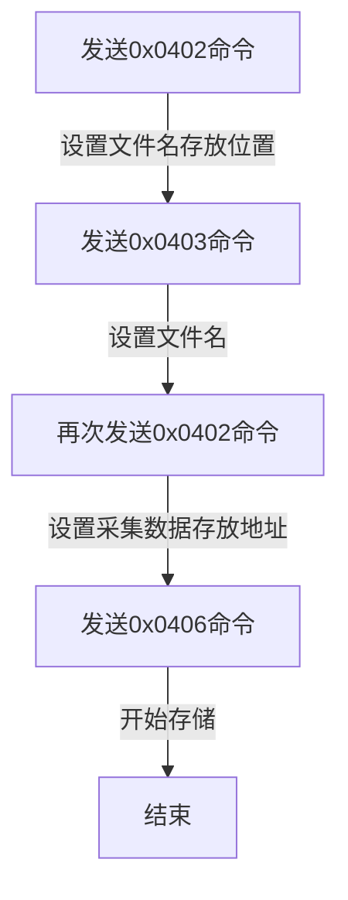

# PC-PS 通信协议

> 上位机 (PC) 与 雷达采集卡 (PS) 之间的通信协议定义。


| 命令码 | 标识符                 | 作用                            | 命令长度 (byte) |
| :----: | :--------------------- | :------------------------------ | :-------------: |
| 0x0100 | search_device          | 查询局域网内下的雷达设备        |        4        |
| 0x0101 | set_date               | 设置系统时间                    |       19        |
| 0x0102 | read_sys_status        | 查询系统状态/<br>响应系统状态   |        4        |
| 0x0103 | reboot                 | 重启采集卡                      |        4        |
| 0x0104 | shutdown               | 关机                            |        4        |
| 0x0110 | system_cmd             | 系统指令                        |      不定       |
|   无   | set_sn                 | 设置SN编号                      |      <=16       |
| 0x0200 | laser_penerate         | 激光器通信数据透传              |      不定       |
| 0x0201 | laser_freq             | 激光重频                        |        4        |
| 0x0202 | laser_enable           | 激光器控制                      |        4        |
| 0x0203 | double_module_penerate | 激光器倍频模块数据透传          |      不定       |
| 0x0300 | preview_enable         | 设置采集状态/<br>接收采集数据   |        4        |
| 0x0301 | preview_coe            | 采集帧抽样率                    |        4        |
| 0x0302 | ref_channal            | 算法参考通道                    |        4        |
| 0x0303 | save_channal           | 上传数据通道                    |        4        |
| 0x0304 | wave_len               | 最大采集长度                    |        4        |
| 0x0305 | first_pos              | 第一段起始位置                  |        4        |
| 0x0306 | first_len              | 第一段采集长度                  |        4        |
| 0x0307 | second_pos             | 第二段起始位置                  |        4        |
| 0x0308 | second_len             | 第二段采集长度                  |        4        |
| 0x0309 | sum_level              | 和阈值                          |        4        |
| 0x0310 | min_level              | 值阈值                          |        4        |
| 0x0320 | adc_width              | 设置ADC采用点位宽               |        4        |
| 0x0321 | pin_threshold          | pin通道信号触发阈值             |        4        |
| 0x0400 | ssd_sector_read        | 读取扇区数据，查询SSD已存储文件 |        8        |
| 0x0401 | ssd_dma_read           | DMA读取                         |       19        |
| 0x0402 | ssd_app_start_lba      | 起始 LBA 地址值                 |        8        |
| 0x0403 | ssd_sector_write       | 向指定扇区写入512字节数据       |       512       |
| 0x0404 | ssd_sector_erase       | 擦除指定扇区                    |        4        |
| 0x0405 | ssd_write_filename     | 设置存储文件名                  |      不定       |
| 0x0406 | ssd_store_enable       | 设置存储状态                    |        4        |
| 0x0410 | gps_up_data            | 上传GPS实时数据                 |       104       |
|        | gps_file_query         | GPS数据文件列表                 |                 |
|        | gps_file_read          | 读取指定GPS数据文件             |                 |
|        | gps_file_delete        | 删除指定GPS数据文件             |                 |
|        | update_ps              | 更新PS程序                      |                 |
|        | update_pl              | 更新PL程序                      |                 |
| 0x0f00 | motor_penerate         | 电机控制                        |                 |
| 0x0f01 |                        | 扩展板DA控制                    |        4        |
| 0x0f02 |                        | 相机触发频率(周期)              |        4        |
| 0x0f03 | trg_mode               | 信号采集模式                    |        4        |
| 0x0f04 | apd_hv_out_en          | 高压输出使能                    |        4        |
| 0x0f05 | adc12qj1600_valid_bit  | 设置adc输出数据位宽             |        4        |
| 0x0f06 | gps_store_enable       | 设置GPS存储状态                 |        4        |
| 0x0f07 | apd_temp_volt_cof      | ADP温度高压补偿系数             |        4        |
| 0x0f08 | led_mode               | 控制系统状态led                 |        8        |
| 0x0f09 | led_freq               | led闪烁频率计数                 |                 |

## 0x0100 — 查询局域网内下的雷达设备

- 命令内容：任意

- 备注

上位机发送udp广播
雷达响应自己IP地址


## 0x0101 — 设置系统时间

- 命令内容：YYYY-MM-DD hh:mm:ss

- 备注

字符串
系统通信成功后发送

## 0x0102 — 查询系统状态/响应系统状态

- 命令内容：0x00:不上传系统状态; 0x01:定时（1s)上传系统状态

## 0x0103 — 重启采集卡

- 命令内容：0x01:重启采集卡，其他无效

## 0x0104 — 关机

- 命令内容：0x01:关机，其他无效

## 0x0110 — 系统指令

- 命令内容：具体命令内容

- 备注

按行返回系统命令响应，总包数始终是1

## 设置SN编号
使用0x0110指令
- 命令内容：
```bash
echo "sn....." > /etc/petalinux/sn
```

## 0x0201 — 激光重频

- 命令内容：激光触发频率，单位：Hz

## 0x0202 — 激光器控制

- 命令内容：00 00 00 01：打开激光器


## 0x0300 — 设置采集状态/接收采集数据

- 命令内容：使能采集：0x01; 停止采集：0x00

- 备注

存储带宽理论最大值250MB/s
实际应按照80%使用
存储带宽计算(MB/s)：`laser_freq * (128 + 8*first_len + (second_len *2 + 4)*4 )/1024/1024`

## 0x0301 — 采集帧抽样率

- 命令内容：抽样系数

- 备注

从FIFO读取5372字节，通过TCP传输大概要900us左右，带宽5.71MB/s
预览数据速度大于5MB/s, 会丢失数据
preview_coe = 1, FIFO会连续保存4次数据

## 0x0302 — 算法参考通道

- 命令内容：0, 以通道0数据为准; 1, 以通道1数据为准; 2, 以通道2数据为准; 3, 以通道3数据为准; 4, 任意通道

## 0x0303 — 上传数据通道

- 命令内容：

| 位     | 值  | 说明            | 默认值 |
| ------ | --- | --------------- | ------ |
| bit[0] | 1   | 上传通道0第一段 | 1      |
| bit[1] | 1   | 上传通道0第二段 | 1      |
| bit[2] | 1   | 上传通道1第一段 | 1      |
| bit[3] | 1   | 上传通道1第二段 | 1      |
| bit[4] | 1   | 上传通道2第一段 | 1      |
| bit[5] | 1   | 上传通道2第二段 | 1      |
| bit[6] | 1   | 上传通道3第一段 | 1      |
| bit[7] | 1   | 必须保留此段    | 1      |

- 备注

目前数据存储格式，需要保证数据总量是4的倍数
即：使能上传的总段数必须是偶数

## 0x0304 — 最大采集长度

- 备注

一次采集数据长度：`(128 + 8 * first_len) + (second_len * 2 + 4) * 4`
上位机需要保证一次采集数据长度不大于8192*0.8

preview_coe = 1, 两段采集长度不超过200

## 0x0306 — 第一段采集长度

- 命令内容：当长度设置为0时，不采集第一段数据

## 0x0308 — 第二段采集长度

- 命令内容：当长度设置为0时，不采集第二段数据

## 0x0309 — 和阈值

- 备注

根据阈值搜索数据的范围：[second_pos, wave_len-800]

M, second_pos,处8点采集数据的平均值

和阈值， 连续8个点值的和 -8*M > 上位机设置值

值阈值， 连续8个点，任意一个点 - M > 上位机设置值

## 0x0320 — 设置ADC采用点位宽

- 命令内容：0x00: 12bit; 0x01: 10bit

- 备注

测试用


## 0x0400 — 读取扇区数据，查询SSD已存储文件

- 命令内容：读取的扇区地址

- 备注

单位：512字节

## 0x0401 — DMA读取

- 命令内容：byte[0:7]：读取扇区的起始位置; byte[8:15]：读取的扇区总个数; byte[16:17]: 单次DMA读取扇区个数，默认2048; byte[18]: 0x00,UDP响应数据; 0x01,TCP响应数据

- 备注

UDP上传速度大概30MB左右

## 0x0402 — 起始 LBA 地址值

- 命令内容：ssd操作地址, 单位：512字节

- 备注

写文件流程：



## 0x0404 — 擦除指定扇区

- 命令内容：任意

## 0x0405 — 设置存储文件名

- 命令内容：文件名，ascii码，不超过512字节

## 0x0406 — 设置存储状态

- 命令内容：0x01:开始存储; 0x00: 停止存储

## GPS 数据


## 0x0410 — 上传GPS实时数据
用0x0110命令
- 命令内容：GPS实时数据

## gps_file_query — GPS数据文件列表

- 命令内容：
```bash  
ls /run/media/mmcblk1p1/
```

## gps_file_read — 读取指定GPS数据文件
使用0x0110命令

- 命令内容：
```bash  
scp root@192.168.1.10:/run/media/mmcblk1p1/file.name .
```

## gps_file_delete — 删除指定GPS数据文件
使用0x0110命令
- 命令内容：
```bash 
rm /run/media/mmcblk1p1/file.name
```

## update_ps — 更新PS程序

- 命令内容：
```bash
pidof main.elf | xargs kill -9
scp main.elf root@192.168.1.10:/home/root
```

## update_pl — 更新PL程序

- 命令内容：
```bash
scp source.bit root@192.168.1.10:/home/root/boot/source.bit
ssh root@192.168.1.10 cp /home/root/boot/source.bit /home/root/boot/sys_top.bit
```

## 0x0f00 — 电机控制

- 命令内容：电机控制数据

## 0x0f01 — 扩展板DA控制

- 命令内容：DA通道序号(0-N)，DA通道值

- 备注

bit[31:16]:DA通道号;0-7,对应A-H

| 通道 | 说明    |
| ---- | ------- |
| ch0  | PMT0    |
| ch1  | PMT1    |
| ch2  | PMT2    |
| ch3  | APD高压 |

bit[15:00]:DA值


上位机设置电压值，实际发送为数字值.
ch0,ch1,ch2
$$value = 65535*V /5, V \leq 5$$


ch3
理论计算 $$ch3\_digtal\_value = (V/270)/5* 65535, V \in (140, 300)$$
和实际有偏差

## 0x0f02 — 相机触发频率(周期)

- 命令内容：触发频率

## 0x0f03 — 信号采集模式

- 备注

0x00, 内触发。
0x01, 外触发。根据激光器给的触发信号来采集数据
0x02, 窗口回波触发。检测到PIN通道第一段信号
需要在配置文件配置，默认内触发

## 0x0f04 — 高压输出使能

- 命令内容：0x01:打开高压; 0x00: 关闭高压

- 备注

APD高压上电后，需要先设置好DAC的值，再开启
转移到PS完成

## 0x0f05 — 设置adc输出数据位宽

- 命令内容：0x01:10bit; 0x00: 12bit

- 备注

默认：0x00

## 0x0f06 — 设置GPS存储状态

- 命令内容：0x01:开始存储; 0x00: 停止存储

## 0x0f08 — 控制系统状态led

- 命令内容：led工作模式

## 0x0f09 — led闪烁频率计数

- 命令内容：8ns周期，方波计算

- 备注

默认:1Hz(1e9/8)
